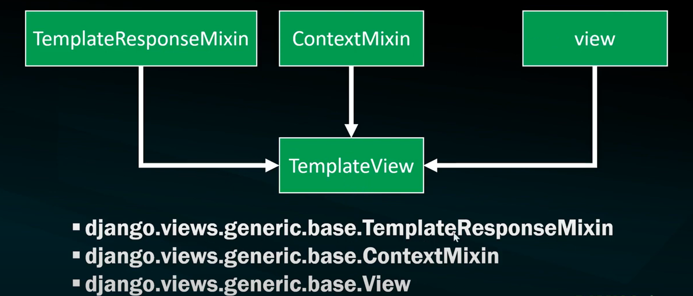

# Django, Class-Based Views (CBVs)

In Django, Class-Based Views (CBVs) are a powerful way to organize the logic of your application. They provide a more object-oriented approach compared to function-based views. CBVs encapsulate the different HTTP methods (GET, POST, etc.) into methods of a class, making it easier to manage and extend your views.

Here's a basic example of a Class-Based View in Django:

```python
from django.views.generic import View
from django.http import HttpResponse

class MyView(View):
    def get(self, request, *args, **kwargs):
        # Logic for handling GET requests
        return HttpResponse("This is a GET request")

    def post(self, request, *args, **kwargs):
        # Logic for handling POST requests
        return HttpResponse("This is a POST request")
```

***In this example:***

- We define a class `MyView` that inherits from `View`.
- Inside the class, we define methods `get()` and `post()`, which correspond to handling GET and POST requests respectively.
- Each method takes `request` as its first argument, which is the HTTP request object.
- Additional arguments `*args` and `**kwargs` are used to capture any additional parameters passed to the view.

You can then map this view to a URL in your `urls.py`:

```python
from django.urls import path
from .views import MyView

urlpatterns = [
    path('my-view/', MyView.as_view(), name='my-view'),
]
```

In this example, any GET request to `/my-view/` will be handled by the `get()` method of `MyView`, and any POST request will be handled by the `post()` method.

Class-Based Views offer a lot of flexibility and allow you to reuse common patterns by subclassing built-in generic views provided by Django, such as `DetailView`, `ListView`, `CreateView`, `UpdateView`, and `DeleteView`. This can greatly reduce code duplication in your application.



## `TemplateView`

In Django, `TemplateView` is a class-based view that renders a template. It's particularly useful when you want to display a static HTML template or when you need to pass some additional context to the template. 

Here's a basic example of how to use `TemplateView`:

```python
from django.views.generic import TemplateView

class HomePageView(TemplateView):
    template_name = 'home.html'

    def get_context_data(self, **kwargs):
        context = super().get_context_data(**kwargs)
        context['welcome_message'] = 'Welcome to our website!'
        return context
```

In this example:

- We define a class `HomePageView` that inherits from `TemplateView`.
- We specify the `template_name` attribute to indicate which template should be rendered (`home.html` in this case).
- We override the `get_context_data()` method to pass additional context to the template. In this example, we're adding a `welcome_message` variable to the context.

You can then map this view to a URL in your `urls.py`:

```python
from django.urls import path
from .views import HomePageView

urlpatterns = [
    path('', HomePageView.as_view(), name='home'),
]
```

This will render the `home.html` template when the root URL of your website is accessed. The `welcome_message` variable will be available in the template, allowing you to display it.

Here's how you might use `home.html`:

```html
<!DOCTYPE html>
<html lang="en">
<head>
    <meta charset="UTF-8">
    <meta name="viewport" content="width=device-width, initial-scale=1.0">
    <title>Welcome</title>
</head>
<body>
    <h1>{{ welcome_message }}</h1>
    <!-- Other HTML content goes here -->
</body>
</html>
```

In this template, `{{ welcome_message }}` will be replaced with the value passed from the view.

`TemplateView` simplifies the process of rendering templates in Django and is a good choice for views that only involve rendering static content or don't require complex logic.

##  `RedirectView`

In Django, `RedirectView` is a class-based view that redirects to a specific URL. It's useful when you need to redirect users from one URL to another, either within your application or to an external URL.

Here's a basic example of how to use `RedirectView`:

```python
from django.views.generic import RedirectView

class MyRedirectView(RedirectView):
    url = '/new-url/'
```

In this example:

- We define a class `MyRedirectView` that inherits from `RedirectView`.
- We specify the `url` attribute to indicate the URL to which the view should redirect (`/new-url/` in this case).

You can then map this view to a URL in your `urls.py`:

```python
from django.urls import path
from .views import MyRedirectView

urlpatterns = [
    path('old-url/', MyRedirectView.as_view(), name='redirect'),
]
```

Now, when a user accesses `/old-url/`, they will be redirected to `/new-url/`.

You can also dynamically determine the URL to which you want to redirect by overriding the `get_redirect_url()` method:

```python
from django.views.generic import RedirectView

class DynamicRedirectView(RedirectView):
    def get_redirect_url(self, *args, **kwargs):
        # Your logic to determine the redirect URL goes here
        return '/dynamic-url/'
```

In this example, you can implement any custom logic within `get_redirect_url()` to dynamically determine the URL to which the view should redirect based on the request or other factors.

`RedirectView` is a convenient way to handle simple redirections in your Django application without having to define a separate view function. It's particularly useful for handling redirects when you need to keep your URL configuration concise and maintainable.

## `DetailView`

In Django, `DetailView` is a class-based view that displays details for a single model instance. It's commonly used when you want to display information about a specific object retrieved from the database.

Here's a basic example of how to use `DetailView`:

```python
from django.views.generic import DetailView
from .models import YourModel

class YourModelDetailView(DetailView):
    model = YourModel
    template_name = 'your_app/your_model_detail.html'
    context_object_name = 'object'  # Optional: Defines the name of the variable in the template

    # Optionally override the get_context_data method to pass additional context to the template
    def get_context_data(self, **kwargs):
        context = super().get_context_data(**kwargs)
        # Add additional context here if needed
        return context
```

In this example:

- We define a class `YourModelDetailView` that inherits from `DetailView`.
- We specify the `model` attribute to indicate which model the view should retrieve data from (`YourModel` in this case).
- We specify the `template_name` attribute to indicate which template should be used to render the view.
- Optionally, we specify the `context_object_name` attribute to define the name of the variable containing the object in the template. If not specified, it defaults to `'object'`.
- Optionally, we override the `get_context_data()` method to pass additional context to the template if needed.

You can then map this view to a URL in your `urls.py`:

```python
from django.urls import path
from .views import YourModelDetailView

urlpatterns = [
    path('your-model/<int:pk>/', YourModelDetailView.as_view(), name='your-model-detail'),
]
```

In this URL pattern, `<int:pk>` is a URL parameter that represents the primary key of the object to be displayed.

Now, when a user accesses `/your-model/1/` (assuming `1` is the primary key of the object), Django will retrieve the corresponding `YourModel` instance from the database and render the `your_model_detail.html` template, passing the object as context.

Here's how you might use `your_model_detail.html`:

```html
<!DOCTYPE html>
<html lang="en">
<head>
    <meta charset="UTF-8">
    <meta name="viewport" content="width=device-width, initial-scale=1.0">
    <title>{{ object.title }}</title>
</head>
<body>
    <h1>{{ object.title }}</h1>
    <p>{{ object.description }}</p>
    <!-- Other details about the object go here -->
</body>
</html>
```

In this template, `{{ object.title }}` and `{{ object.description }}` will be replaced with the corresponding attributes of the `YourModel` instance.

## `ListView`

In Django, `ListView` is a class-based view that displays a list of objects retrieved from the database. It's commonly used when you want to display multiple instances of a model in a paginated list format.

Here's a basic example of how to use `ListView`:

```python
from django.views.generic import ListView
from .models import YourModel

class YourModelListView(ListView):
    model = YourModel
    template_name = 'your_app/your_model_list.html'
    context_object_name = 'object_list'  # Optional: Defines the name of the variable in the template
    paginate_by = 10  # Optional: Number of objects per page

    # Optionally override the get_context_data method to pass additional context to the template
    def get_context_data(self, **kwargs):
        context = super().get_context_data(**kwargs)
        # Add additional context here if needed
        return context
```

***In this example:***

- We define a class `YourModelListView` that inherits from `ListView`.
- We specify the `model` attribute to indicate which model the view should retrieve data from (`YourModel` in this case).
- We specify the `template_name` attribute to indicate which template should be used to render the view.
- Optionally, we specify the `context_object_name` attribute to define the name of the variable containing the list of objects in the template. If not specified, it defaults to `'object_list'`.
- Optionally, we specify the `paginate_by` attribute to indicate the number of objects to display per page. Pagination is enabled automatically if this attribute is set.

You can then map this view to a URL in your `urls.py`:

```python
from django.urls import path
from .views import YourModelListView

urlpatterns = [
    path('your-model-list/', YourModelListView.as_view(), name='your-model-list'),
]
```

Now, when a user accesses `/your-model-list/`, Django will retrieve all instances of `YourModel` from the database and render the `your_model_list.html` template, passing the list of objects as context.

Here's how you might use `your_model_list.html`:

```html
<!DOCTYPE html>
<html lang="en">
<head>
    <meta charset="UTF-8">
    <meta name="viewport" content="width=device-width, initial-scale=1.0">
    <title>Your Model List</title>
</head>
<body>
    <h1>Your Model List</h1>
    <ul>
        
            <li>{{ object }}</li>
        
    </ul>
    <!-- Pagination links will be automatically added if paginate_by is set -->
</body>
</html>
```

In this template, `` iterates over the list of objects passed from the view, and `{{ object }}` is replaced with the string representation of each object.

## `FormView`

In Django, `FormView` is a class-based view that displays a form, processes submitted data, and renders the appropriate response. It's commonly used when you need to display a form to the user, handle form validation, and process form submission.

Here's a basic example of how to use `FormView`:

```python
from django.views.generic import FormView
from .forms import YourForm
from django.urls import reverse_lazy
from django.http import HttpResponseRedirect

class YourFormView(FormView):
    template_name = 'your_app/your_form.html'
    form_class = YourForm
    success_url = reverse_lazy('success')

    def form_valid(self, form):
        # Process form data
        # Here you can access cleaned form data using form.cleaned_data
        # For example:
        # form.save()
        return super().form_valid(form)
```

***In this example:***

- We define a class `YourFormView` that inherits from `FormView`.
- We specify the `template_name` attribute to indicate which template should be used to render the form.
- We specify the `form_class` attribute to indicate which form class should be used for the view (`YourForm` in this case).
- We specify the `success_url` attribute to indicate where the user should be redirected after the form submission is successful. We use `reverse_lazy()` to specify the URL name ('success') instead of a hardcoded URL. You can replace `'success'` with the name of the URL you want to redirect to.

Additionally, we override the `form_valid()` method to define what should happen when the form submission is valid. Inside this method, you can access the cleaned form data using `form.cleaned_data` and perform any necessary processing, such as saving the form data to the database.

You can then map this view to a URL in your `urls.py`:

```python
from django.urls import path
from .views import YourFormView

urlpatterns = [
    path('your-form/', YourFormView.as_view(), name='your-form'),
    path('success/', SuccessView.as_view(), name='success'),  # Define a success view to redirect to
]
```

Now, when a user accesses `/your-form/`, Django will render the `your_form.html` template containing the form. After the user submits the form, if the form data is valid, they will be redirected to the `'success'` URL.

Here's how you might use `your_form.html`:

```html
<!DOCTYPE html>
<html lang="en">
<head>
    <meta charset="UTF-8">
    <meta name="viewport" content="width=device-width, initial-scale=1.0">
    <title>Your Form</title>
</head>
<body>
    <h1>Your Form</h1>
    <form method="post">
        
        {{ form.as_p }}
        <button type="submit">Submit</button>
    </form>
</body>
</html>
```

In this template, `{{ form.as_p }}` is a Django template tag that renders the form fields as paragraphs. You can use other `as_*` methods provided by Django forms to render the form in different formats.

## `CreateView`

In Django, `CreateView` is a class-based view used for displaying a form for creating a new object and handling the submission of that form. It's particularly useful when you need to create new instances of a model and handle form validation.

Here's a basic example of how to use `CreateView`:

```python
from django.views.generic import CreateView
from .models import YourModel
from .forms import YourModelForm
from django.urls import reverse_lazy

class YourModelCreateView(CreateView):
    model = YourModel
    form_class = YourModelForm
    template_name = 'your_app/your_model_form.html'
    success_url = reverse_lazy('success')

    def form_valid(self, form):
        # Process form data
        # Here you can access cleaned form data using form.cleaned_data
        # For example:
        # form.save()
        return super().form_valid(form)
```

***In this example:***

- We define a class `YourModelCreateView` that inherits from `CreateView`.
- We specify the `model` attribute to indicate which model the view should create instances of (`YourModel` in this case).
- We specify the `form_class` attribute to indicate which form class should be used for the view (`YourModelForm` in this case).
- We specify the `template_name` attribute to indicate which template should be used to render the form.
- We specify the `success_url` attribute to indicate where the user should be redirected after the form submission is successful. We use `reverse_lazy()` to specify the URL name ('success') instead of a hardcoded URL. You can replace `'success'` with the name of the URL you want to redirect to.

Additionally, we override the `form_valid()` method to define what should happen when the form submission is valid. Inside this method, you can access the cleaned form data using `form.cleaned_data` and perform any necessary processing, such as saving the form data to the database.

You can then map this view to a URL in your `urls.py`:

```python
from django.urls import path
from .views import YourModelCreateView

urlpatterns = [
    path('create/', YourModelCreateView.as_view(), name='create'),
    path('success/', SuccessView.as_view(), name='success'),  # Define a success view to redirect to
]
```

Now, when a user accesses `/create/`, Django will render the `your_model_form.html` template containing the form for creating a new object. After the user submits the form, if the form data is valid, they will be redirected to the `'success'` URL.

Here's how you might use `your_model_form.html`:

```html
<!DOCTYPE html>
<html lang="en">
<head>
    <meta charset="UTF-8">
    <meta name="viewport" content="width=device-width, initial-scale=1.0">
    <title>Create Your Model</title>
</head>
<body>
    <h1>Create Your Model</h1>
    <form method="post">
        
        {{ form.as_p }}
        <button type="submit">Submit</button>
    </form>
</body>
</html>
```

In this template, `{{ form.as_p }}` is a Django template tag that renders the form fields as paragraphs. You can use other `as_*` methods provided by Django forms to render the form in different formats.

## `UpdateView`

In Django, `UpdateView` is a class-based view used for displaying a form to update an existing object and handling the submission of that form. It's particularly useful when you need to update instances of a model and handle form validation.

Here's a basic example of how to use `UpdateView`:

```python
from django.views.generic import UpdateView
from .models import YourModel
from .forms import YourModelForm
from django.urls import reverse_lazy

class YourModelUpdateView(UpdateView):
    model = YourModel
    form_class = YourModelForm
    template_name = 'your_app/your_model_form.html'
    success_url = reverse_lazy('success')

    def form_valid(self, form):
        # Process form data
        # Here you can access cleaned form data using form.cleaned_data
        # For example:
        # form.save()
        return super().form_valid(form)
```

In this example:

- We define a class `YourModelUpdateView` that inherits from `UpdateView`.
- We specify the `model` attribute to indicate which model the view should update instances of (`YourModel` in this case).
- We specify the `form_class` attribute to indicate which form class should be used for the view (`YourModelForm` in this case).
- We specify the `template_name` attribute to indicate which template should be used to render the form.
- We specify the `success_url` attribute to indicate where the user should be redirected after the form submission is successful. We use `reverse_lazy()` to specify the URL name ('success') instead of a hardcoded URL. You can replace `'success'` with the name of the URL you want to redirect to.

Additionally, we override the `form_valid()` method to define what should happen when the form submission is valid. Inside this method, you can access the cleaned form data using `form.cleaned_data` and perform any necessary processing, such as saving the form data to the database.

You can then map this view to a URL in your `urls.py`:

```python
from django.urls import path
from .views import YourModelUpdateView

urlpatterns = [
    path('update/<int:pk>/', YourModelUpdateView.as_view(), name='update'),
    path('success/', SuccessView.as_view(), name='success'),  # Define a success view to redirect to
]
```

Now, when a user accesses `/update/<pk>/`, where `<pk>` is the primary key of the object to be updated, Django will render the `your_model_form.html` template containing the form for updating the object. After the user submits the form, if the form data is valid, they will be redirected to the `'success'` URL.

Here's how you might use `your_model_form.html`:

```html
<!DOCTYPE html>
<html lang="en">
<head>
    <meta charset="UTF-8">
    <meta name="viewport" content="width=device-width, initial-scale=1.0">
    <title>Update Your Model</title>
</head>
<body>
    <h1>Update Your Model</h1>
    <form method="post">
        
        {{ form.as_p }}
        <button type="submit">Submit</button>
    </form>
</body>
</html>
```

In this template, `{{ form.as_p }}` is a Django template tag that renders the form fields as paragraphs. You can use other `as_*` methods provided by Django forms to render the form in different formats.

## `DeleteView`

In Django, `DeleteView` is a class-based view used for displaying a confirmation page for deleting an object and handling the deletion process. It's particularly useful when you want to provide users with a way to delete instances of a model.

Here's a basic example of how to use `DeleteView`:

```python
from django.views.generic import DeleteView
from .models import YourModel
from django.urls import reverse_lazy

class YourModelDeleteView(DeleteView):
    model = YourModel
    template_name = 'your_app/your_model_confirm_delete.html'
    success_url = reverse_lazy('success')
```

In this example:

- We define a class `YourModelDeleteView` that inherits from `DeleteView`.
- We specify the `model` attribute to indicate which model the view should delete instances of (`YourModel` in this case).
- We specify the `template_name` attribute to indicate which template should be used to render the confirmation page for deletion.
- We specify the `success_url` attribute to indicate where the user should be redirected after the object is successfully deleted. We use `reverse_lazy()` to specify the URL name ('success') instead of a hardcoded URL. You can replace `'success'` with the name of the URL you want to redirect to.

You can then map this view to a URL in your `urls.py`:

```python
from django.urls import path
from .views import YourModelDeleteView

urlpatterns = [
    path('delete/<int:pk>/', YourModelDeleteView.as_view(), name='delete'),
    path('success/', SuccessView.as_view(), name='success'),  # Define a success view to redirect to
]
```

Now, when a user accesses `/delete/<pk>/`, where `<pk>` is the primary key of the object to be deleted, Django will render the `your_model_confirm_delete.html` template containing the confirmation page for deleting the object. After the user confirms the deletion, the object will be deleted from the database, and the user will be redirected to the `'success'` URL.

Here's how you might use `your_model_confirm_delete.html`:

```html
<!DOCTYPE html>
<html lang="en">
<head>
    <meta charset="UTF-8">
    <meta name="viewport" content="width=device-width, initial-scale=1.0">
    <title>Confirm Deletion</title>
</head>
<body>
    <h1>Confirm Deletion</h1>
    <p>Are you sure you want to delete this object?</p>
    <form method="post">
        
        <button type="submit">Yes, delete</button>
        <a href="">Cancel</a>
    </form>
</body>
</html>
```

In this template, `` generates a URL using the name 'cancel', which can be another view for canceling the deletion process. You need to define this URL in your `urls.py`.
