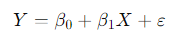
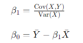

To find the intercept and coefficients (also known as slopes) in a regression equation, you typically use a method called Ordinary Least Squares (OLS). Here's how it works:

1. **Formulate the Regression Equation**: Start with a hypothesis of the relationship between the dependent variable (Y) and one or more independent variables (X). For a simple linear regression with one independent variable, the equation is:

   \[ Y = \beta_0 + \beta_1X + \varepsilon \]

   Where:
   
   - \( Y \) is the dependent variable.
   - \( X \) is the independent variable.
   - \( \beta_0 \) is the intercept (the value of \( Y \) when \( X \) is 0).
   - \( \beta_1 \) is the coefficient (the slope of the line).
   - \( \varepsilon \) represents the error term.

2. **Collect Data**: Gather data on the dependent and independent variables.

3. **Calculate Means**: Calculate the mean of both the dependent and independent variables.

4. **Calculate Covariance and Variance**: Compute the covariance between the dependent and independent variables, as well as the variance of the independent variable.

5. **Estimate Coefficients**: Use the formulas to estimate the coefficients:
   

   \[ \beta_1 = \frac{{\text{Cov}(X,Y)}}{{\text{Var}(X)}} \]

   \[ \beta_0 = \bar{Y} - \beta_1\bar{X} \]

   Where:
   - \( \text{Cov}(X,Y) \) is the covariance between \( X \) and \( Y \).
   - \( \text{Var}(X) \) is the variance of \( X \).
   - \( \bar{Y} \) and \( \bar{X} \) are the means of \( Y \) and \( X \), respectively.

6. **Interpret the Results**: Once you've estimated the coefficients, interpret them in the context of your problem. The intercept represents the value of \( Y \) when \( X \) is 0, and the coefficient represents the change in \( Y \) for a one-unit change in \( X \).

7. **Assess the Model Fit**: Evaluate how well the regression equation fits the data using metrics like R-squared, which measures the proportion of the variance in the dependent variable that is predictable from the independent variable(s).

These steps outline the basic process of finding the intercept and coefficients in a regression equation using Ordinary Least Squares.