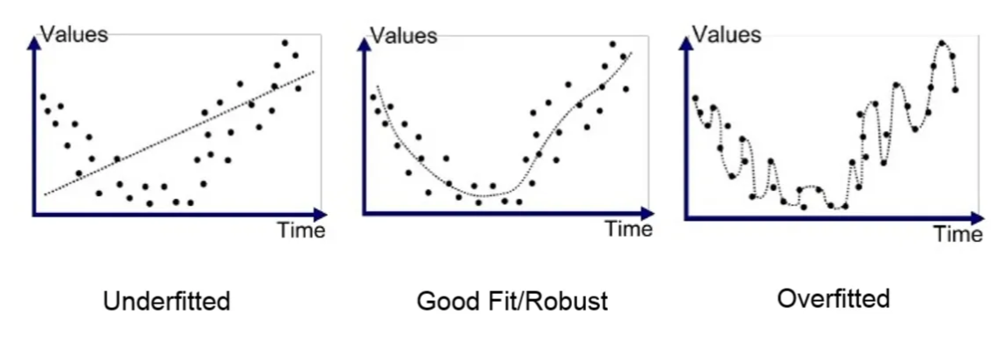
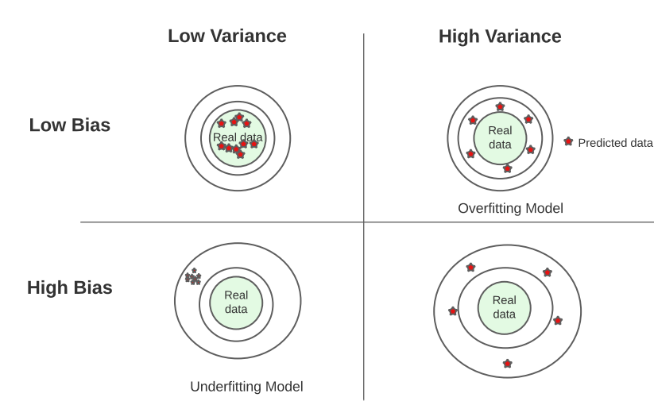
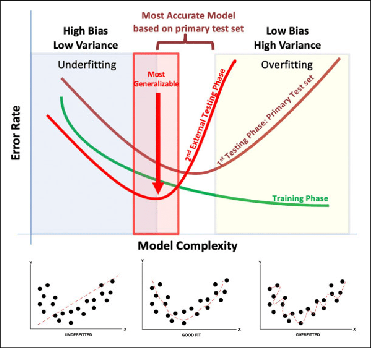

# Overfitting in machine learning

Overfitting is a common challenge in machine learning where a model learns the training data too well, capturing noise or random fluctuations in the data rather than the underlying pattern. This leads to poor generalization performance, where the model performs well on the training data but poorly on unseen data (i.e., testing or validation data).

There are several reasons why overfitting occurs:

1. **Model Complexity**: Complex models, such as those with many parameters or high-degree polynomial functions, have greater flexibility to fit the training data closely. However, this increased flexibility also makes them more prone to overfitting, especially when the training data is limited.

2. **Insufficient Data**: When the amount of training data is limited, the model may have difficulty generalizing patterns and instead memorizes the training examples, including noise.

3. **Noisy Data**: Data that contains random variations or errors (noise) can confuse the learning algorithm, leading it to capture these variations rather than the underlying pattern.

4. **Feature Overfitting**: Including irrelevant features or too many features relative to the number of samples can also lead to overfitting. The model may learn relationships that do not generalize well to new data.

5. **Lack of Regularization**: Regularization techniques, such as L1 (Lasso) or L2 (Ridge) regularization, penalize overly complex models by adding a regularization term to the loss function. Without regularization, models may overfit more easily.

Overfitting can be diagnosed by evaluating the model's performance on a separate validation dataset or through techniques like cross-validation. To mitigate overfitting, various strategies can be employed:

- **Simplifying the Model**: Use simpler models with fewer parameters or lower complexity to reduce the risk of overfitting.
- **Increasing Data**: Collecting more training data can help the model generalize better and reduce overfitting, especially when data is limited.
- **Regularization**: Apply regularization techniques to penalize overly complex models, discouraging them from fitting noise.
- **Feature Selection**: Select relevant features and avoid including irrelevant ones, reducing the risk of overfitting due to feature complexity.
- **Cross-Validation**: Use techniques like k-fold cross-validation to assess model performance and select hyperparameters that minimize overfitting.

Overall, understanding and mitigating overfitting is crucial for building machine learning models that generalize well to unseen data and perform effectively in real-world applications.

## underfitting in machine learning

Underfitting is the opposite of overfitting and occurs when a machine learning model is too simple to capture the underlying structure of the data. In other words, the model fails to learn the patterns present in the training data, resulting in poor performance not only on the training data but also on unseen data.

There are several reasons why underfitting may occur:

1. **Model Complexity**: The model may be too simple to capture the underlying relationships in the data. For example, using a linear model to represent a highly nonlinear relationship would likely result in underfitting.

2. **Insufficient Features**: The features used to train the model may not be informative enough to capture the patterns in the data. Inadequate feature selection or feature engineering can lead to underfitting.

3. **Insufficient Training**: The model may not have been trained for a sufficient number of epochs or iterations, or the learning rate may have been too low, preventing the model from converging to an optimal solution.

4. **Noise in Data**: If the data contains a significant amount of noise or irrelevant information, the model may struggle to discern the underlying signal from the noise.

5. **Over-regularization**: Excessive use of regularization techniques, such as L1 or L2 regularization, can lead to underfitting by overly penalizing model complexity.

Underfitting can be identified by observing the model's performance on both the training and validation datasets. Signs of underfitting include high training error and high validation error, indicating that the model is not capturing the underlying patterns in the data.

To address underfitting, several strategies can be employed:

- **Increase Model Complexity**: Use more complex models that can better capture the underlying relationships in the data. This could involve using a model with more parameters, such as a neural network with additional layers or units.

- **Feature Engineering**: Improve the quality of the features used for training by selecting more informative features or creating new features through feature engineering techniques.

- **Reduce Regularization**: If regularization is too strong, reducing its intensity or removing it altogether may help alleviate underfitting.

- **Increase Training Data**: Collecting more data or augmenting existing data can provide the model with more information to learn from and help mitigate underfitting.

- **Adjust Hyperparameters**: Experiment with different hyperparameters, such as learning rate, batch size, or optimization algorithm, to find configurations that lead to better model performance.

By addressing underfitting, models can better capture the underlying patterns in the data and achieve improved performance on both training and unseen data.

## bias-variance trade-off in machine learning

The bias-variance trade-off is a fundamental concept in machine learning that describes the relationship between a model's bias, its variance, and its predictive performance.

- **Bias**: Bias refers to the error introduced by approximating a real-world problem with a simplified model. A high bias model is overly simplistic and tends to underfit the training data, failing to capture the true underlying patterns in the data.

- **Variance**: Variance refers to the model's sensitivity to fluctuations in the training data. A high variance model is overly complex and captures noise or random fluctuations in the training data, leading to overfitting.

The trade-off arises because reducing bias often increases variance and vice versa. This trade-off is illustrated graphically as follows:

- **High Bias, Low Variance**: Models with high bias and low variance tend to be too simple and generalize poorly to both the training and test data. They underfit the data by oversimplifying the underlying patterns.

- **Low Bias, High Variance**: Models with low bias and high variance tend to be too complex and fit the training data too closely, capturing noise or random fluctuations. While they may perform well on the training data, they generalize poorly to unseen data.

- **Optimal Trade-off**: The goal in machine learning is to find the optimal trade-off between bias and variance that minimizes the total error on unseen data. This is typically achieved by selecting a model with moderate complexity that can capture the underlying patterns in the data without overfitting.

Strategies to manage the bias-variance trade-off include:

1. **Model Complexity**: Adjusting the complexity of the model to find the right balance between bias and variance. For example, in decision trees, controlling the tree depth can control model complexity.

2. **Regularization**: Using regularization techniques, such as L1 or L2 regularization, to penalize overly complex models and reduce variance.

3. **Cross-Validation**: Using techniques like k-fold cross-validation to evaluate model performance on different subsets of the data and selecting the model with the best trade-off between bias and variance.

4. **Ensemble Methods**: Combining multiple models, such as bagging or boosting, to reduce variance and improve generalization performance.

Understanding and managing the bias-variance trade-off is crucial for building machine learning models that generalize well to unseen data and perform effectively in real-world applications.